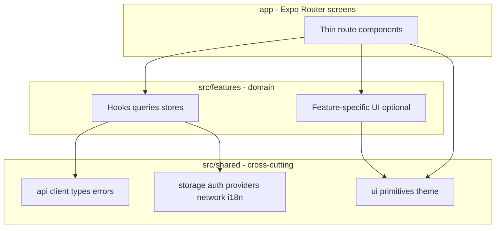

# Krishi AI Saathi — Mobile & Web (Expo)

Production-grade [Expo SDK 52](https://docs.expo.dev/) app: **Android**, **iOS**, and **web** (React Native Web). TypeScript **strict**, **Expo Router** file-based routing, **NativeWind** (Tailwind) for styling, **TanStack Query** for server/async state, **Zustand** for small client state, and a **feature-sliced** layout so new work has a clear home.

On-device answers can use a native Gemma bridge (`modules/gemma-llm`) when built for Android; the app escalates to the backend `POST /api/v1/query` per routing rules when appropriate.

---

## Table of contents

1. [Tech stack](#tech-stack)
2. [Prerequisites](#prerequisites)
3. [Getting started](#getting-started)
4. [Environment variables](#environment-variables)
5. [Scripts](#scripts)
6. [Frontend architecture](#frontend-architecture)
7. [Folder structure](#folder-structure)
8. [Path aliases (imports)](#path-aliases-imports)
9. [Conventions: where to put new code](#conventions-where-to-put-new-code)
10. [Design patterns used here](#design-patterns-used-here)
11. [UI, theming, and components](#ui-theming-and-components)
12. [Platform-specific code (`.native` / `.web`)](#platform-specific-code-native--web)
13. [Testing](#testing)
14. [CI](#ci)
15. [Further reading](#further-reading)

---

## Tech stack

| Area                     | Choice                                                                                    |
| ------------------------ | ----------------------------------------------------------------------------------------- |
| Runtime                  | React 18, React Native 0.76, React Native Web                                             |
| App & routing            | Expo Router 4 (file-based routes under `app/`)                                            |
| Language                 | TypeScript (strict)                                                                       |
| Styling                  | NativeWind 4 + Tailwind 3 + `global.css`                                                  |
| Server / async data      | TanStack Query v5                                                                         |
| Local UI / session state | Zustand (keep stores small and feature-scoped)                                            |
| i18n                     | i18next + react-i18next (`src/shared/i18n/`)                                              |
| Forms / validation       | react-hook-form + zod (when needed)                                                       |
| Native storage           | `expo-sqlite` + `expo-secure-store` on device; web uses JS fallbacks (see platform files) |
| Networking               | `@react-native-community/netinfo` (native); `navigator.onLine` on web                     |

---

## Prerequisites

- **Node.js 20+**
- **JDK 17** (for Android)
- **Android Studio** + SDK + emulator or USB device (for Android builds)
- **Xcode** (for iOS, macOS only)
- **Expo CLI** via `npx expo` (no global install required)

---

## Getting started

```bash
cp .env.example .env
npm install
```

**Start the dev server (pick platform in the terminal UI):**

```bash
npm start
# then press: a (Android) | i | w (web)
```

**Direct targets:**

```bash
npm run android   # expo start --android
npm run ios       # expo start --ios
npm run web       # expo start --web
```

**Android dev client (native modules, e.g. Gemma):**

```bash
npx expo prebuild --platform android
npx expo run:android
```

`expo prebuild` generates the `android/` (and `ios/` when used) native projects. `expo run:android` builds the dev client, installs it, and starts Metro.

---

## Environment variables

Copy [`.env.example`](./.env.example) to `.env`. Anything exposed to the JavaScript bundle **must** use the `EXPO_PUBLIC_` prefix.

| Variable                              | Purpose                                                             |
| ------------------------------------- | ------------------------------------------------------------------- |
| `EXPO_PUBLIC_API_BASE_URL`            | Backend base URL (default in example targets Android emulator host) |
| `EXPO_PUBLIC_USE_NATIVE_GEMMA`        | `1` only when the native Gemma module is linked after prebuild      |
| `EXPO_PUBLIC_NATIVE_GEMMA_MODEL_PATH` | Path to bundled model on device, when applicable                    |

Never put secrets in `EXPO_PUBLIC_*` variables; they are visible in the client bundle.

---

## Scripts

| Script               | Command                                  |
| -------------------- | ---------------------------------------- |
| `npm start`          | Expo dev server                          |
| `npm run lint`       | ESLint                                   |
| `npm run typecheck`  | `tsc --noEmit`                           |
| `npm test`           | Jest (unit + app test projects)          |
| `npm run test:watch` | Jest watch mode                          |
| `npm run format`     | Prettier write                           |
| `npm run smoke`      | Production smoke script (see `scripts/`) |

---

## Frontend architecture

High-level layers (dependencies flow **downward** only):



- **`app/`** — Route files only: composition, navigation, and wiring. **No** heavy business logic; call hooks from `src/features/*` and shared providers.
- **`src/features/*`** — One folder per product feature (e.g. `chat`, `mandi`, `onboarding`). Owns hooks, small stores, repos that are specific to that feature, and optional feature-only components.
- **`src/shared/*`** — Everything reused by **multiple** features: HTTP client, API types, design tokens, primitives (`Button`, `Input`, …), auth helpers, DB/secure storage facades, i18n, root providers.

This keeps screens thin and makes features testable in isolation.

---

## Folder structure

```
.
├── app/                          # Expo Router: URL = file path
│   ├── _layout.tsx               # Root stack + providers wrapper
│   ├── index.tsx                 # Entry redirect (onboarding vs tabs)
│   ├── scan.tsx                  # Standalone screen
│   ├── (onboarding)/             # Onboarding flow (group)
│   │   ├── _layout.tsx
│   │   ├── welcome.tsx
│   │   ├── language.tsx
│   │   ├── location.tsx
│   │   ├── model-download.tsx
│   │   └── done.tsx
│   └── (tabs)/                   # Main app tabs
│       ├── _layout.tsx
│       ├── home.tsx
│       ├── chat.tsx
│       ├── mandi.tsx
│       └── profile.tsx
│
├── src/
│   ├── features/                 # Feature slices (domain-first)
│   │   ├── chat/                 # e.g. useSendQuery, chatMessagesRepo, guessDeviceIntent
│   │   ├── mandi/
│   │   ├── onboarding/           # store, useInitialSync, onboardingStorage, etc.
│   │   └── twin/
│   │
│   └── shared/                   # Shared kernel
│       ├── api/                  # client.ts, endpoints, types, errors, routing
│       ├── auth/                 # AuthProvider, anonymous id, clerk helpers
│       ├── config/               # env, constants
│       ├── i18n/                 # locales (en.json, hi.json), localeKeys test
│       ├── network/              # useConnectivity (+ .web / .native), NetworkBanner
│       ├── ondevice/             # Gemma / mock / native backend wiring
│       ├── providers/            # RootProviders (Query, i18n, fonts, DB init)
│       ├── storage/              # db (.web/.native), secure (.web/.native), bundle
│       ├── ui/
│       │   ├── primitives/     # Button, Input, ListItem — app-wide building blocks
│       │   └── theme/            # tokens (colors, radii — align with tailwind)
│       ├── utils/                # guards, uuid, small pure helpers
│       └── voice/                # STT/TTS client abstractions
│
├── modules/                      # Local Expo native modules (e.g. gemma-llm)
├── assets/                       # Images, fonts (as referenced from app.config)
├── scripts/                      # smoke tests, utilities
├── maestro/                      # E2E flows (optional)
├── app.config.ts                 # Expo config (env, plugins)
├── global.css                    # Tailwind / NativeWind base
├── tailwind.config.js            # theme extensions (colors, fonts)
├── metro.config.js
├── babel.config.js
├── jest.config.js                # unit-ts + app (jest-expo) projects
```


---

## Path aliases (imports)

Configured in [`tsconfig.json`](./tsconfig.json):

| Alias          | Maps to          |
| -------------- | ---------------- |
| `@/app/*`      | `app/*`          |
| `@/features/*` | `src/features/*` |
| `@/shared/*`   | `src/shared/*`   |
| `@/modules/*`  | `modules/*`      |

**Prefer** `@/features/...` and `@/shared/...` over long relative paths.

---

## Conventions: where to put new code

| You are adding…                                       | Put it in…                                                                                         |
| ----------------------------------------------------- | -------------------------------------------------------------------------------------------------- |
| New screen or tab                                     | `app/` — new file or group; keep the file **thin**                                                 |
| API call + types for one domain                       | `src/shared/api/` (types, `endpoints.ts`, `client`) or a feature hook that **uses** `apiFetch`     |
| Feature-specific hook (e.g. “load mandi from bundle”) | `src/features/<name>/`                                                                             |
| Feature-specific Zustand store                        | `src/features/<name>/` (e.g. `onboarding/store.ts`)                                                |
| Reusable UI (buttons, inputs, list rows)              | `src/shared/ui/primitives/`                                                                        |
| Screen-only layout for one feature                    | Prefer colocating under `src/features/<name>/components/` **if** not reused; otherwise primitives  |
| Cross-feature provider                                | `src/shared/providers/`                                                                            |
| New locale strings                                    | `src/shared/i18n/locales/en.json` + `hi.json` (keep keys in **parity** — see `localeKeys.test.ts`) |
| Platform-specific implementation                      | Same basename with **`.native.ts`** / **`.web.ts`** (see below)                                    |
| Unit tests                                            | Next to source: `*.test.ts` or `*.test.tsx`; Jest projects in `jest.config.js`                     |

**Naming:** `useX` for hooks, `XProvider` for React context providers, `*Repo` for persistence helpers, kebab-case for route files (Expo Router convention).

### Public API rule (imports via barrels)

Every feature and every `src/shared/*` subfolder exposes its public surface through an `index.ts` barrel. Screens and cross-feature code import **from the barrel**, not from internal file paths:

```ts
// good
import { useSendChatMessage, CONFIDENCE_THRESHOLD_LOW } from "@/features/chat";
import { Button } from "@/shared/ui/primitives";
import { apiFetch } from "@/shared/api";

// avoid (reaches into internals without a reason)
import { useSendChatMessage } from "@/features/chat/useSendQuery";
```

Internal files **inside** the same feature or subfolder may import from siblings directly — barrels are for consumers.

### Grow rule (flat until it earns structure)

Start flat. A feature only splits into subfolders when it's actually doing too much:

- Add `components/` only when the feature owns **>0 feature-scoped components**.
- Add `hooks/` only when a feature has **>3 hooks**.
- Add `api/` only when the feature owns its **own endpoint module**.
- Consider splitting once a feature crosses **~6 files**. Do the split in a dedicated `refactor(...)` PR, not mixed with feature work.

This avoids the trap of empty `api/`, `components/`, `types/` folders created "just in case."

---

## Design patterns used here

1. **Feature slices** — Each feature folder groups what changes together (chat, mandi, onboarding). Reduces merge conflicts and clarifies ownership.
2. **Thin routes** — `app/*.tsx` compose UI and call hooks; routing concerns stay in `app/`, domain logic in `src/features`.
3. **Single API boundary** — Use `src/shared/api/client.ts` (`apiFetch`) for HTTP so headers, errors, and env base URL stay consistent.
4. **Query keys as contract** — TanStack Query keys live next to hooks (e.g. `MANDI_QUERY_KEY`); invalidate on mutations/sync.
5. **Platform split** — Native modules (SQLite, SecureStore, NetInfo nuances) ship as `.native.ts`; web uses `.web.ts` so the web bundle never imports unsupported native modules.
6. **Optimistic UX** — Network banner and connectivity are **best-effort**; app remains usable offline where data exists (bundle, SQLite / web equivalents).

---

## UI, theming, and components

- **Styling:** NativeWind `className` with tokens defined in [`tailwind.config.js`](./tailwind.config.js) (e.g. `brand`, `page`, `ink`, `wheat` for CTA surfaces). Keep **spacing and typography** consistent with existing screens.
- **Primitives:** Reuse `src/shared/ui/primitives/*` before adding one-off buttons/inputs.
- **Theme tokens:** [`src/shared/ui/theme/tokens.ts`](./src/shared/ui/theme/tokens.ts) for values that must be read in JS; mirror Tailwind where possible.
- **Accessibility:** Prefer `accessibilityRole`, `accessibilityLabel` on tappable elements (see onboarding screens for examples).
- **i18n:** No user-facing copy in code strings — add keys to both `en.json` and `hi.json`.

---

## Platform-specific code (`.native` / `.web`)

Metro resolves **one file per platform** for the same import path:

- `thing.ts` — Default for TypeScript / Node (often re-exports a safe implementation for tests).
- `thing.web.ts` — Web bundle.
- `thing.native.ts` — iOS + Android.

Examples in this repo: `src/shared/storage/db.*`, `src/shared/storage/secure.*`, `src/shared/network/useConnectivity.*`.

**Rule:** Do not import `expo-sqlite` or `expo-secure-store` from code that runs on web; use the shared `db` / `secure` facades or add a `.web.ts` implementation.

---

## Testing

- **`src/**/\*.test.ts`** — `ts-jest` in Node (fast unit tests, no native modules by default).
- **`*.{test.tsx,test.jsx}`** — `jest-expo` for React Native–oriented component tests.
- Mocks: see `jest.setup.js`, `jest.setup.node.js` for project-specific shims.

Run `npm test` before opening a PR; CI runs the same.

---

## CI

GitHub Actions (`.github/workflows/ci.yml`) runs: `npm ci` → `lint` → `typecheck` → `test --ci`.

---

---


## Contributing (short checklist)

1. Branch from `main` (or the repo default).
2. Add code in the **correct layer** (table above).
3. Add or update **i18n** keys in **both** languages.
4. Run `npm run lint`, `npm run typecheck`, `npm test`.
5. If you add a new **feature** folder, include a one-line **README** comment at the top of the main hook or a `src/features/<name>/README.md` only if the feature is non-obvious (optional; keep the root README the source of truth for structure).

This keeps the repo **predictable** for the next developer: _screens in `app/`, domain in `src/features/`, shared kernel in `src/shared/`, platform splits explicit, and quality gates in CI_.
